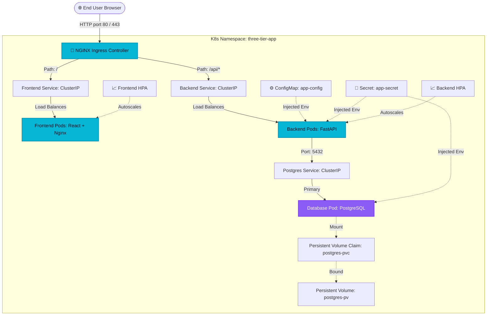

# ⚓ Production-Grade Three-Tier Kubernetes Application

This repository showcases an enterprise-ready, three-tier cloud-native web application deployed on a Kubernetes cluster. Designed with dev-to-prod parity and cloud engineering best practices, it serves as a robust blueprint for microservices deployment, container security, network isolation, and horizontal auto-scaling.

---

## 🏗️ Architecture Diagram



---

## 🛠️ Tech Stack

- **Frontend**: React (v18) + Vite (TypeScript) styled with a high-end, responsive Vanilla CSS Glassmorphism design. Served using an optimized static NGINX Alpine server.
- **Backend**: FastAPI (Python 3.11) with SQLAlchemy ORM, database connection pools, a custom Prometheus metrics middleware, and a dual-purpose `/health` connection checker.
- **Database**: PostgreSQL (v15) with auto-initialization schema and seed data.
- **Containerization**: Optimized multi-stage Dockerfiles separating build environments from secure non-root runtimes.
- **Orchestration**: Kubernetes manifests defining strict namespace limits, HPA limits, liveness/readiness probes, pod-level network policy controls, and affinity specifications.
- **CI/CD**: GitHub Actions workflows verifying backend tests (pytest), frontend compilation, static manifest validation (`kubeconform`), and multi-stage container builds.

---

## 📂 Folder Structure

```
three-tier-kubernetes-app/
├── .github/
│   └── workflows/
│       └── ci-cd.yml          # GitHub Actions Pipeline
├── backend/
│   ├── main.py                # FastAPI Application Code
│   ├── requirements.txt       # Python Libraries
│   └── test_main.py           # Pytest Test Cases
├── database/
│   └── init.sql               # PostgreSQL Schema & Seed Data
├── docker/
│   ├── backend.Dockerfile     # Production Python Container
│   ├── frontend.Dockerfile    # Multi-stage React Container
│   └── nginx.conf             # Frontend Nginx Configuration
├── docs/
│   └── deployment_guide.md    # Detailed Installation Instructions
├── frontend/
│   ├── package.json           # Frontend Scripts & NPM Packages
│   ├── tsconfig.json          # TypeScript Config
│   ├── vite.config.ts         # Vite Compiler Config
│   ├── index.html             # App Entry HTML Page
│   └── src/
│       ├── main.tsx           # React bootstrap script
│       ├── App.tsx            # Main UI Logic & CRUD requests
│       └── App.css            # Custom CSS & Glassmorphism theme
├── k8s/
│   ├── namespace.yaml         # Namespace declaration (three-tier-app)
│   ├── config/
│   │   ├── configmap.yaml     # System configs
│   │   └── secret.yaml        # Encrypted passwords
│   ├── database/
│   │   ├── db-init-configmap.yaml # Seed SQL ConfigMap
│   │   ├── persistent-volume.yaml # PV Allocation
│   │   ├── persistent-volume-claim.yaml # PVC Request
│   │   ├── deployment.yaml    # Postgres Deployment
│   │   └── service.yaml       # Internal ClusterIP
│   ├── backend/
│   │   ├── deployment.yaml    # FastAPI Deployment (2 replicas + Probes)
│   │   └── service.yaml       # Internal API ClusterIP
│   ├── frontend/
│   │   ├── deployment.yaml    # Nginx Static UI (2 replicas)
│   │   └── service.yaml       # Internal Web ClusterIP
│   ├── ingress/
│   │   └── ingress.yaml       # Nginx Ingress Route / Rewrite Rule
│   └── bonus/
│       ├── hpa.yaml           # Frontend/Backend HPA autoscalers
│       ├── network-policy.yaml# Segregated security rules
│       ├── pdb.yaml           # Pod disruption parameters
│       └── resource-quota.yaml# Namespace quota and limit rules
└── README.md                  # Project Overview (This file)
```

---

## ⚡ Quick Start: Kubernetes Deployment

For detailed configurations on **Docker Desktop**, **Minikube**, **Kind**, or **AWS EKS**, see the [docs/deployment_guide.md](file:///f:/project-cv/Three-Tier%20Kubernetes%20Application/docs/deployment_guide.md). Below is the standard local Minikube deployment:

1. **Start Cluster & Enable Ingress**:
   ```bash
   minikube start --driver=docker --addons=ingress
   ```

2. **Build Docker Images inside Minikube's Registry**:
   ```bash
   # Linux/macOS
   eval $(minikube docker-env)
   
   # Build
   docker build -t three-tier-backend:latest -f docker/backend.Dockerfile .
   docker build -t three-tier-frontend:latest -f docker/frontend.Dockerfile .
   ```

3. **Apply manifests in sequence**:
   ```bash
   kubectl apply -f k8s/namespace.yaml
   kubectl apply -f k8s/config/
   kubectl apply -f k8s/database/
   kubectl apply -f k8s/backend/
   kubectl apply -f k8s/frontend/
   kubectl apply -f k8s/ingress/
   kubectl apply -f k8s/bonus/
   ```

4. **Access the application**:
   - Run `minikube tunnel` in a separate terminal.
   - Access the dashboard at [http://localhost](http://localhost).
   - Verify health at [http://localhost/api/health](http://localhost/api/health).
   - Check Prometheus metrics at [http://localhost/api/metrics](http://localhost/api/metrics).

---

## 🛠️ Verification and Troubleshooting Commands

### Cluster Status Inspections
```bash
# Verify namespace Pods
kubectl get pods -n three-tier-app -o wide

# Check Ingress host assignment
kubectl get ingress -n three-tier-app

# Inspect Service routes
kubectl get svc -n three-tier-app
```

### Logging and Debugging
```bash
# Check FastAPI logs
kubectl logs -n three-tier-app -l app=backend --tail=100 -f

# Inspect database initialization logs
kubectl logs -n three-tier-app -l app=postgres --tail=100

# Inspect pod configuration (e.g. env overrides)
kubectl describe pod -n three-tier-app -l app=backend
```

---

## 🔄 DevOps Operations

### 📈 Scaling
Autoscaling is pre-configured via the HPA metric. If you want to manually scale the frontend or backend deployments:
```bash
kubectl scale deployment/backend-deployment --replicas=5 -n three-tier-app
kubectl scale deployment/frontend-deployment --replicas=5 -n three-tier-app
```

### 🚀 Zero-Downtime Rolling Update
If you push updates to your container image:
```bash
# Set new image tag
kubectl set image deployment/backend-deployment backend=three-tier-backend:v1.1.0 -n three-tier-app

# Check progress of update rollout
kubectl rollout status deployment/backend-deployment -n three-tier-app

# Rollback update if probes fail
kubectl rollout undo deployment/backend-deployment -n three-tier-app
```

---

## ⚡ Troubleshooting Common Issues

1. **Database Connection Errors**:
   If the backend throws a `Database connection failed` crashloop, ensure the secret is correctly applied and the database service name `postgres-service` matches `DB_HOST` in the ConfigMap.
2. **Ingress 404/503 Errors**:
   - Ensure the Ingress controller is enabled (`minikube addons enable ingress`).
   - Run `kubectl describe ingress app-ingress -n three-tier-app` and ensure the endpoints are pointing to the frontend and backend IP addresses.
3. **Local Docker Image Pull Errors**:
   Verify you ran `eval $(minikube docker-env)` or `kind load docker-image` before deploying, as Kubernetes pods defaults to pull images from Docker Hub unless configured locally.

---

## 🔮 Future Improvements

1. **Cert-Manager SSL Integration**: Configure automated Let's Encrypt TLS certificate provisioning.
2. **ArgoCD GitOps**: Set up declarative GitOps sync for manifests.
3. **Istio Service Mesh**: Add strict mTLS encryption between pods, tracing via Jaeger, and traffic splitting rules.
